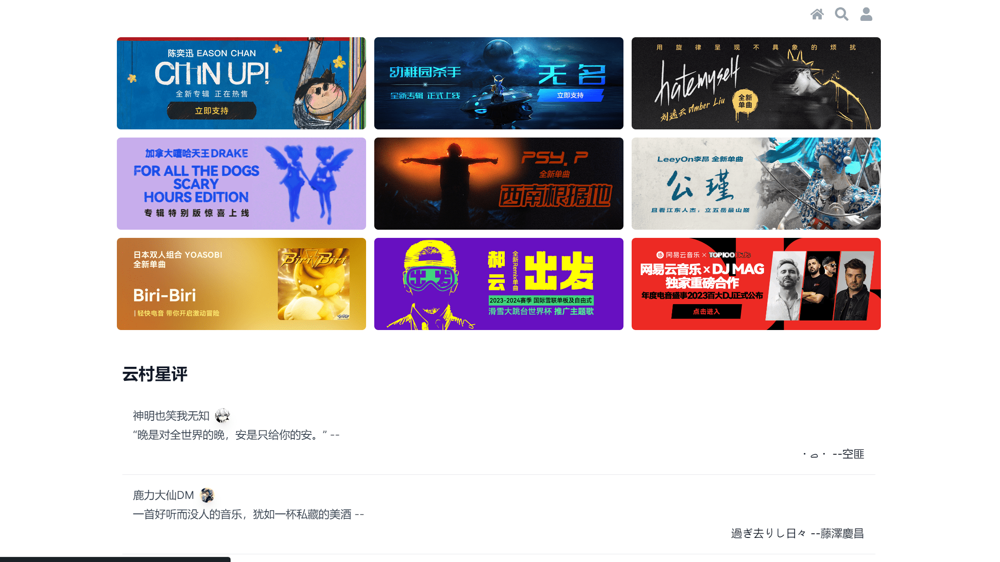

[preview page](https://nextjs-netease-music.vercel.app/)

> [!TIP]
> 由于线上API不够稳定且速度慢, 建议本地测试, 部分页面请求会加载失败, 可在开发者工具中查看具体原因
## Feature

* 接口类型 100% 类型安全

## TODO

<!-- starpick avatar  -->

<!-- 97-78417250c6c92500.js:1 Error: Minified React error #482; visit https://reactjs.org/docs/error-decoder.html?invariant=482 for the full message or use the non-minified dev environment for full errors and additional helpful warnings.
    at nC (6358292e-a7d6d2e2d6935da0.js:1:29244)
    at rN (6358292e-a7d6d2e2d6935da0.js:1:41624)
    at Object.r_ [as use] (6358292e-a7d6d2e2d6935da0.js:1:41810)
    at t.use (97-78417250c6c92500.js:1:98311)
    at 746-ceac6e374c522058.js:200:10199
    at 746-ceac6e374c522058.js:200:5833
    at page-db5caa298455ebed.js:1:9647
    at 746-ceac6e374c522058.js:200:5971
    at 746-ceac6e374c522058.js:200:6175
    at o (page-db5caa298455ebed.js:1:843) -->

- [x] 星评
- [x] 歌曲 + 评论
- [x] 相似歌曲
- [x] 登录(二维码)
- [x] 歌曲搜索
- [x] 每日推荐
- [x] 热门歌曲,歌单
- [x] 首页轮播图
- [x] 歌手信息
- [x] use svg qrcode
- [x] MV + 评论
- [x] 专辑 + 评论
- [ ] 歌单播放
- [ ] videos
- [ ] 榜单
- [ ] 搜索页面完善
- [ ] 用户信息界面完善
- [ ] 评论分页
- [ ] 播放器
- [ ] 支持歌单播放
- [ ] 用户图片动态加载
- [ ] update latest comment btn
- [ ] 用户歌单 /user/playlist?uid=32953014
- [ ] simi mv 结果相同

<!-- - [x] [301](https://github.com/Binaryify/NeteaseCloudMusicApi/issues/961) -->
<!-- - [ ] 支持直接调用 [neteasemusicapi](https://github.com/Binaryify/NeteaseCloudMusicApi/issues/1842) -->

<!-- https://github.com/imsyy/SPlayer/blob/dev/src/api/home.js -->

<!-- ```
Error: ENOENT: no such file or directory, scandir 'D:\Workspace\react-music\.next\server\vendor-chunks\module'
``` -->
<!-- - mp3 cache -->
<!-- - 跨域问题() -->
