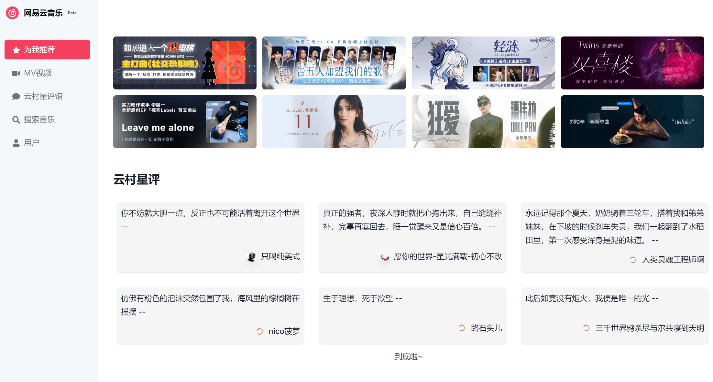

[preview page](https://nextjs-netease-music.vercel.app/)

> [IMPORTANT]
> 如果没有登录, 部分页面将会导致加载错误, 原因未知(开发环境伪造了请求头, 和线上环境不一致, 不方便排查).

## TODO

- [x] 星评
- [x] 歌曲评论
- [x] 相似歌曲
- [x] 登录(二维码)
- [x] 歌曲搜索
- [x] 每日推荐
- [x] 热门歌曲,歌单
- [x] 首页轮播图
- [x] 歌手信息
- [x] cookie login
- [x] use svg qrcode
- [x] MV
- [ ] 搜索页面完善
- [ ] 用户信息界面完善
- [ ] 加载歌曲loading完善
- [ ] 支持游客登录
- [ ] 评论分页
- [ ] 播放器
- [ ] 支持歌单播放

<!-- - [x] [301](https://github.com/Binaryify/NeteaseCloudMusicApi/issues/961) -->
<!-- - [ ] 支持直接调用 [neteasemusicapi](https://github.com/Binaryify/NeteaseCloudMusicApi/issues/1842) -->

<!-- https://github.com/imsyy/SPlayer/blob/dev/src/api/home.js -->

<!-- ```
Error: ENOENT: no such file or directory, scandir 'D:\Workspace\react-music\.next\server\vendor-chunks\module'
``` -->
<!-- - mp3 cache -->
<!-- - 跨域问题() -->
